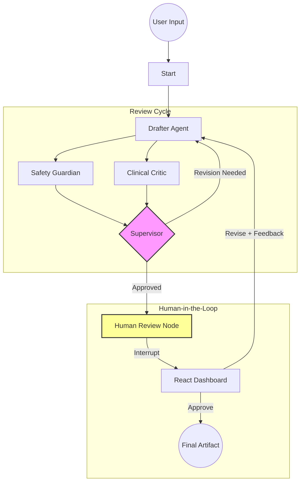

# System Architecture

## Agent Topology (Supervisor-Worker)

The system uses a **Supervisor-Worker** pattern orchestrated by LangGraph. 

## Data Flow & State ("The Blackboard")

The agents share a `AgentState` object that acts as a blackboard.

1.  **Input**: User intent is written to `user_intent`.
2.  **Drafting**: `Drafter` writes to `current_draft` and `scratchpad`.
3.  **Critique**: `Guardian` and `Critic` read `current_draft` and write to `safety_score`, `empathy_score`, and `feedback` lists.
4.  **Decision**: `Supervisor` reads scores.
    *   If scores < 8: Updates `status="revision_needed"`.
    *   If scores >= 8: Updates `status="completed"`.
5.  **Persistence**: `SqliteSaver` checkpoints the state at every step to `checkpoints.sqlite`.

## Interfaces

### Interface A: React Dashboard (FastAPI + SSE)
*   **Streaming**: Connects to `/stream/{thread_id}` to receive real-time updates of the `scratchpad`.
*   **Intervention**: Uses `/resume/{thread_id}` to inject `human_approved` or `human_feedback` into the state.

### Interface B: MCP Server
*   **Protocol**: Implements Model Context Protocol via `mcp-python`.
*   **Tool**: Exposes `create_cbt_exercise`.
*   **Execution**: Runs the graph with `interrupt=False` for full autonomy.

